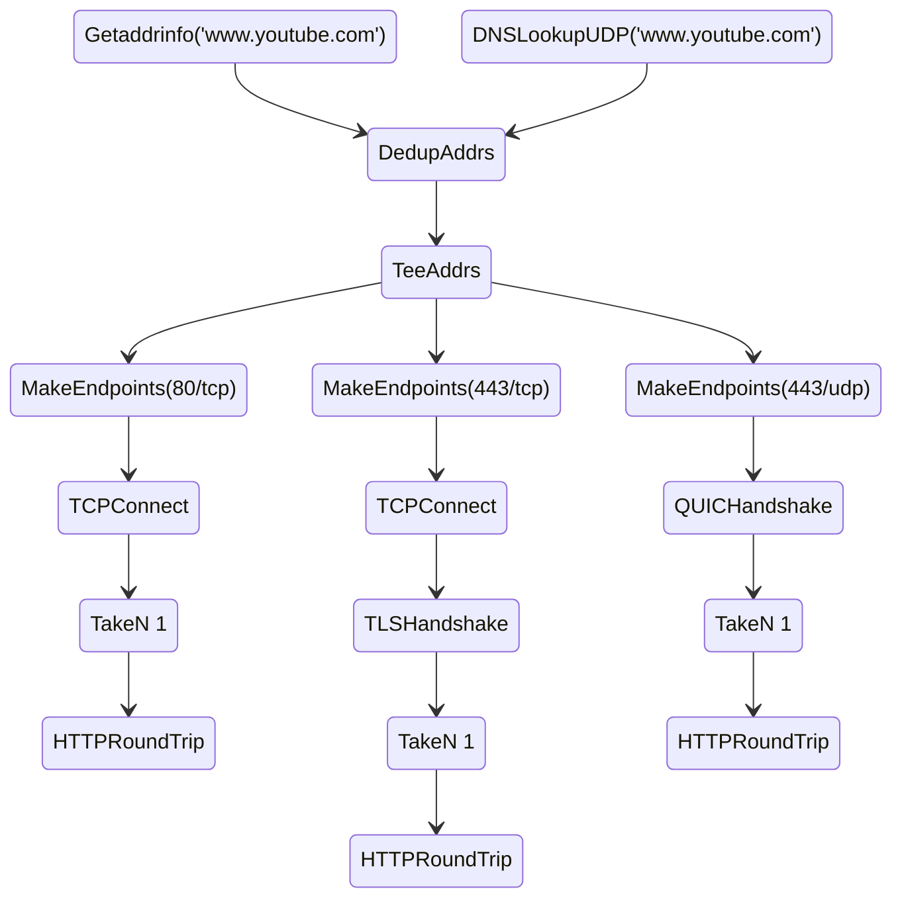

# 2023-12-09-ooni-javascript

This repository implements an experimental JavaScript console for OONI Probe.

This repository requires Go >= 1.20.12. Using an higher version of Go is possible
and should work. Using a lower version is not recommended.

## Debian developer setup

The following commands show how to setup a development environment using Debian 12 ("bookworm"). The
same instructions should also work for Debian-based distribution (e.g., Ubuntu).

```bash
# install the compilers, git, and the root CA
sudo apt install golang build-essential ca-certificates git

# [optional] install mingw-w64 if you're targeting windows
sudo apt install mingw-w64

# install the required go version binary
go install -v golang.org/dl/go1.20.12@latest

# fetch the whole go distribution
$HOME/go/bin/go1.20.12 download
```

## Fedora developer setup

The following commands show how to setup a development environment using Fedora.

```bash
# install the compilers and git
sudo dnf install golang make gcc gcc-c++ git

# [optional] install mingw-w64 if you're targeting windows
sudo dnf install mingw64-gcc mingw64-gcc-c++

# install the required go version binary
go install -v golang.org/dl/go1.20.12@latest

# fetch the whole go distribution
$HOME/go/bin/go1.20.12 download
```

## macOS developer setup

The following commands show how to setup a development environment using macOS. We assume you
have already installed Homebrew, which should also install the Xcode command line tools.

Then, you need to follow these instructions:

```bash
# install the compiler
brew install go

# install the required go version binary
go install -v golang.org/dl/go1.20.12@latest

# fetch the whole go distribution
$HOME/go/bin/go1.20.12 download
```

## Build instructions

Once you have installed the correct Go version and a C compiler, you can compile using:

```bash
$HOME/go/bin/go1.20.12 build -v -ldflags '-s -w' ./cmd/jsconsole
```

This command will generate a stripped binary called `jsconsole` in the toplevel directory.

## Usage

Create a script that runs the `signal` experiment as follows:

```JavaScript
"use strict"

const signal = require("ooni/experiment/signal")

console.log(signal.experimentName())
console.log(signal.experimentVersion())
console.log(signal.run())
```

save it as `main.js` and run it using:

```bash
./jsconsole main.js
```

You can also experiment with creating and executing DSLs for performing
OONI measurements directly. For example, considering this experiment definition:



where we basically resolve `www.youtube.com` using two DNS resolvers, then
deduplicate addresses (`DedupAddrs`) and copy the addresses (using `TeeAddrs`)
such that we test `80/tcp`, `443/tcp`, and `443/udp` while making sure
we make a single HTTP request per port (with `TakeN 1`).

The corresponding JavaScript implementation of the above DSL is:

```JavaScript
"use strict"

const dsl = require("ooni/dsl")
const time = require("golang/time")

const builder = new dsl.Builder()

// implement the DNS lookup part of the DSL
const addresses = builder.dedupAddrs(
	builder.dnsLookupUdp("www.youtube.com"),
	builder.getaddrinfo("www.youtube.com"),
)

// implement the 80/tcp pipeline
function port80tcp(addresses) {
	const endpoints = builder.makeEndpoints("80", addresses)
	const conns = builder.tcpConnect(endpoints)
	builder.httpRoundTrip("www.youtube.com", builder.takeN(1, conns))
}

// implement the 443/tcp pipeline
function port443tcp(addresses) {
	const endpoints = builder.makeEndpoints("443", addresses)
	const conns = builder.tcpConnect(endpoints)
	const tlsConns = builder.tlsHandshake("www.youtube.com", ["h2", "http1/1.1"], conns)
	builder.httpRoundTrip("www.youtube.com", builder.takeN(1, tlsConns))
}

// implement the 443/udp pipeline
function port443udp(addresses) {
	const endpoints = builder.makeEndpoints("443", addresses)
	const conns = builder.quicHandshake("www.youtube.com", ["h3"], endpoints)
	builder.httpRoundTrip("www.youtube.com", builder.takeN(1, conns))
}

// tie it all together
builder.teeAddrs(addresses, port80tcp, port443tcp, port443udp)

// build and execute the DSL
const root = builder.buildRootNode()
const now = time.now()
const tk = dsl.run(root, now)

console.log(JSON.stringify(tk))
```

## Repository structure

We use [ooni/probe-engine](https://github.com/ooni/probe-engine) to import
internal OONI Probe packages. We import these packages:

* [dslvm](https://github.com/ooni/probe-engine/tree/v0.27.0/pkg/x/dslvm): low-level DSL implementation;
* [dslengine](https://github.com/ooni/probe-engine/tree/v0.27.0/pkg/x/dslengine): engine for running the low-level DSL;
* [dsljson](https://github.com/ooni/probe-engine/tree/v0.27.0/pkg/x/dsljson): JSON representation for the DSL;
* [dsljavascript](https://github.com/ooni/probe-engine/tree/v0.27.0/pkg/x/dsljavascript): JavaScript DSL implementation.

We use [dop251/goja](https://github.com/dop251/goja) as the JavaScript engine.

The [typescript](typescript) directory contains TypeScript code from which we generate the
corresponding JavaScript code inside [javascript](javascript) code.

* [typescript/golang](typescript/golang/) contains wrappers to invoke
Go functions from TypeScript;

* [typescript/ooni/experiment](typescript/ooni/experiment/) contains
the TypeScript implementation of OONI experiments;

* [typescript/ooni/micropipeline](typescript/ooni/micropipeline) functionality
to analyze OONI measurements;

* [typescript/ooni/dsl](typescript/ooni/dsl) allows to create
and run a JSON-encoded DSL using JavaScript code.
